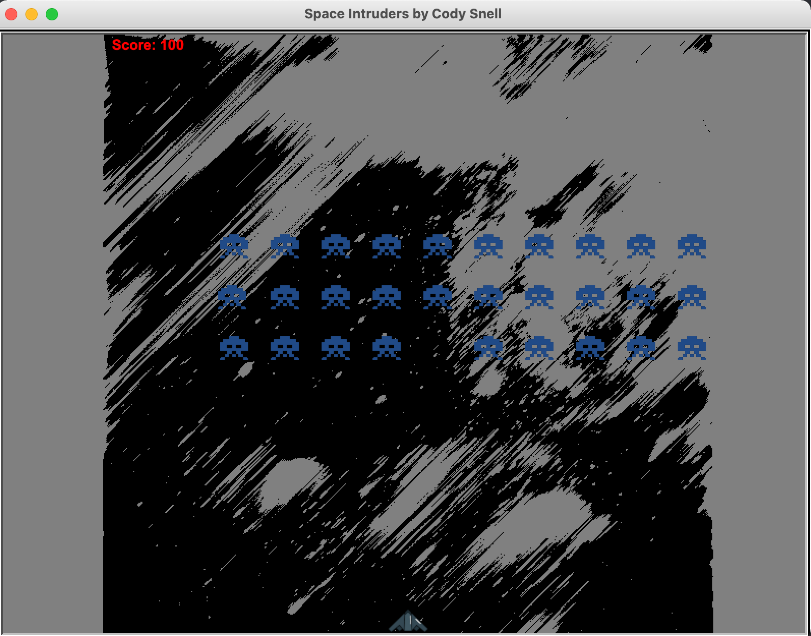

# Space Intuders

This repository contains python based interactive Space Intuders game.

## Running Space Intuders:

```
git clone https://github.com/Decibullz/python-space-intruders.git
cd python-space-intruders
python space-intruders.py
```

## Screenshots
<p align="center">


</p>

## Controls
1. Game auto starts
2. Left arrow to move left
3. Right arrow to move right
4. Spacebar to shoot
5. A track of player score is maintained
6. Game ends at 3000 points to win, or when Intruders land/hit your ship
7. Game Auto restarts after 5 seconds


## Author
Cody Snell